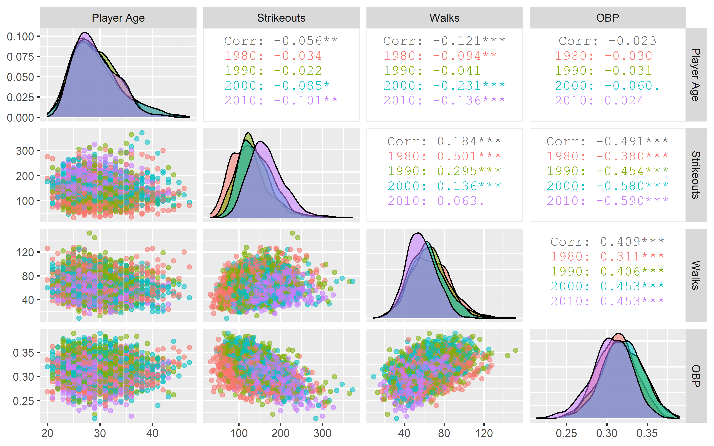
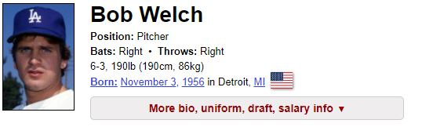

```{r setup, include=FALSE}
knitr::opts_chunk$set(echo = FALSE)
```


## Original Premise

- We originally wanted to set up a scouting report for every batter in the league, using some custom statistics derived from advanced batting statistics. We would then produce a heatmap and detailed scouting report of what sorts of pitches work on every batter, and where in the zone it worked. Gleefully, we set about finding our data.
- Our data exists, but isn't cheap. Back to the drawing board.
- Instead, we decided to see if we could predict the net number of wins a pitcher was worth based on his ERA (earned run average), OBP (Opponent On-base percentage), and whatever else could think of. We found a package called Lahman that would do the job.

## Beginning Research

- Here, we're going to look at how we selected and in some cases created the column data we needed.
```{r error=FALSE, message=FALSE, warning=FALSE, echo=FALSE}
library(aod)
library(mgcv)
library(ggplot2)
library(tidyverse)
library(dplyr)
library(rbokeh)
library(quanteda)
library(Lahman)
library(DT)
library(shiny)
```

# Select columns from the Pitching dataset
pitchers <- select(tibble(Pitching), playerID, yearID, teamID, IPouts, BB, SO, BAOpp, ERA, W, L)
# Create a Net Wins column
pitchers <- pitchers %>% mutate(NetWins = W-L)
# Only keep rows where there is no missing data
pitchers <- pitchers[complete.cases(pitchers),]
# Normalize data so that coefficients are meaningful
pitchers <- pitchers %>% mutate(normIPouts = (IPouts - mean(IPouts)) / sd(IPouts))
pitchers <- pitchers %>% mutate(normBB = (BB - mean(BB)) / sd(BB))
pitchers <- pitchers %>% mutate(normSO = (SO - mean(SO)) / sd(SO))
pitchers <- pitchers %>% mutate(normBAOpp = (BAOpp - mean(BAOpp)) / sd(BAOpp))
pitchers <- pitchers %>% mutate(normERA = (ERA - mean(ERA)) / sd(ERA))

```{r error=FALSE, echo=TRUE, message=FALSE, warning=FALSE, include=TRUE}
#Here, we look at the relevant data from Lahman

#Select columns from the Pitching dataset
pitchers <- select(tibble(Pitching), playerID, yearID, teamID, IPouts, BB, SO, BAOpp, ERA, W, L)


#Create a Net Wins column
pitchers <- pitchers %>% mutate(NetWins = W-L)

#Only keep rows where there is no missing data
pitchers <- pitchers[complete.cases(pitchers),]

#Normalize data so that coefficients are meaningful
pitchers <- pitchers %>% mutate(normIPouts = (IPouts - mean(IPouts)) / sd(IPouts))
pitchers <- pitchers %>% mutate(normBB = (BB - mean(BB)) / sd(BB))
pitchers <- pitchers %>% mutate(normSO = (SO - mean(SO)) / sd(SO))
pitchers <- pitchers %>% mutate(normBAOpp = (BAOpp - mean(BAOpp)) / sd(BAOpp))
pitchers <- pitchers %>% mutate(normERA = (ERA - mean(ERA)) / sd(ERA))
```

## Building linear model

-Finally, we can build our model, as is accomplished below.

rsquared:
```{r lm, error=FALSE, message=FALSE, warning=FALSE, echo=FALSE, include=TRUE}

#Build Linear Model
mylm <- lm(NetWins ~ normIPouts + normBB + normSO + normBAOpp + normERA, data = pitchers)

#Analyze Findings
x<-summary(mylm)
x$r.squared 

```
 
 
 
## Building a Generalized Additive Model  

- That last model sucked. Let's try again with a better model.

mygam <- gam(NetWins ~ normIPouts + normBB + normSO + normBAOpp + normERA, data = pitchers)

rsquared:
```{r gam, error=FALSE, message=FALSE}

#Note, these findings mean that our regression sucks. Trying a new regression.
mygam <- gam(NetWins ~ normIPouts + normBB + normSO + normBAOpp + normERA, data = pitchers)
#summary(mygam)
summary(mygam)$r.squared

```

## Building a Generalized Linear Model

- That last model sucked too. Let's try another one--a generalized linear model.

myglm <- glm(NetWins ~ normIPouts + normBB + normSO + normBAOpp + normERA, family = gaussian, data = pitchers)

rsquared
```{r glm, error=FALSE, message=FALSE, warning=FALSE, include=TRUE}

#Note, these results also suck. Trying a new regression.
myglm <- glm(NetWins ~ normIPouts + normBB + normSO + normBAOpp + normERA, family = gaussian, data = pitchers)
#summary(myglm)
summary(myglm)$r.squared
```

## Building models

-Wow, that went well. Let's see if we can figure out any kind of a model that works at all--even ones that are nonlinear and completely unintuitive to normal humans. 

-We're going to throw everything at it. We are inevitable.

-Put on that infinity glove and snap your fingers

```{r interaction, error=FALSE, message=FALSE, warning=FALSE, echo=FALSE, include=TRUE}

#Note, all of these results still suck. Going to try an interaction model with everything

#Select columns from the Pitching dataset
pitchers <- tibble(Pitching)

#Create a Net Wins column
pitchers <- pitchers %>% mutate(NetWins = W-L)

#Only keep rows where there is no missing data
pitchers <- pitchers[complete.cases(pitchers),]


#mylm <- lm(NetWins ~ IPouts*HR*BB*SO*BAOpp*ERA*IBB*WP*HBP*BK*BFP*GIDP, data = pitchers)

#Analyze Findings
#summary(mylm)
#summary(mylm)$r.squared 
```

## After the MCU

- Well look at that, we snapped our fingers and explained just over half of the variation. Excellent work team! 

- Just kidding, we need to be able to do a lot better than this.

- Clearly, this isn't going as well as it might've. Let's make some graphs and see what we can find before we build another model. 

## Crossplot

```{r, echo=FALSE, out.width='100%'}

```


## Interesting Things

To me, the most interesting thing was strikeouts by OBP, so I made an interactive graph.

## Interactive OBP x Strikeouts

```{r interactive graph, error=FALSE, message=FALSE, warning=FALSE, include=TRUE }

#Read in data, cast as tibble
pitchers <-  read_csv("stats.csv")
pitchers <- tibble(pitchers)

pitchers <- pitchers %>% mutate(name=paste(first_name, last_name))

pitchers <- pitchers %>% mutate(name=paste(first_name, last_name))

pitchers <- pitchers[order(pitchers$player_age),]

pitchers <- pitchers[order(pitchers$name),]

colnames(pitchers)[colnames(pitchers) == "player_age"] <- "Player Age"
colnames(pitchers)[colnames(pitchers) == "name"] <- "Name"
colnames(pitchers)[colnames(pitchers) == "year"] <- "Year"
colnames(pitchers)[colnames(pitchers) == "p_strikeout"] <- "Strikeouts"
colnames(pitchers)[colnames(pitchers) == "p_walk"] <- "Walks"
colnames(pitchers)[colnames(pitchers) == "on_base_percent"] <- "OBP"


#Add an empty column that we can populate in the next chunk
emptycolumn <- c("Years_In_Pitching")
pitchers[ , emptycolumn] <- NA


pitchers$Years_In_Pitching[1]<-1

i<-2
while (i < length(pitchers$Years_In_Pitching)){
  if(i==1){
    pitchers$Years_In_Pitching[i]=1
    i=i+1
    }
  else if(pitchers$Name[i]==pitchers$Name[i-1]){
    pitchers$Years_In_Pitching[i]=pitchers$Years_In_Pitching[i-1]+1
    i=i+1
    }
  else if(pitchers$Name[i]!=pitchers$Name[i-1]){
    pitchers$Years_In_Pitching[i] = 1
    i=i+1
  }
}

pitchers <- pitchers %>% mutate(decade = (Year %/% 10)*10)
pitchers <- pitchers %>% mutate(Decade = format(decade, digits = 4))


figure(width = 800, height = 500) %>%
  ly_points(x = OBP, y = Strikeouts, color = Decade,
  data = pitchers, hover = list(Name, Year, OBP, Strikeouts))

```

## OBP x Walks

```{r, error=FALSE, message=FALSE, warning=FALSE, include=TRUE}
figure(width = 800, height = 500) %>%
  ly_points(x = OBP, y = Walks, color = Decade,
  data = pitchers, hover = list(Name, Year, OBP, Strikeouts))
```

## Strikeouts x Walks

```{r, error=FALSE, message=FALSE, warning=FALSE, include=TRUE}
figure(width = 800, height = 500) %>%
  ly_points(x = Strikeouts, y = Walks, color = Decade,
  data = pitchers, hover = list(Name, Year, OBP, Strikeouts))
```

## Advanced pitching metrics

- We're going to look at projecting OBP and Wins using some advanced metrics.

```{r error=FALSE, message=FALSE, warning=FALSE, echo=FALSE, include=TRUE}
advancedPitchers <-  read_csv("AdvancedPitcherMetrics.csv")
advancedPitchers <- tibble(advancedPitchers)
advancedPitchers <- advancedPitchers %>% mutate(name=paste(first_name, last_name))

advancedPitchers <- advancedPitchers %>% mutate(name=paste(first_name, last_name))

advancedPitchers <- advancedPitchers[order(advancedPitchers$name),]
```
advancedPitchers <- read_csv("AdvancedPitcherMetrics.csv")  
advancedPitchers <- tibble(advancedPitchers)  
advancedPitchers <- advancedPitchers %>% mutate(name=paste(first_name, last_name))  
advancedPitchers <- advancedPitchers %>% mutate(name=paste(first_name, last_name))  
advancedPitchers <- advancedPitchers[order(advancedPitchers$name),]  

## Fastball speed 
```{r}
ggplot(data = advancedPitchers) + geom_point(aes(x = fastball_avg_speed, y = on_base_percent, color= year))
```

## Hard Hit Percent
```{r}
ggplot(data = advancedPitchers) + geom_point(aes(x = hard_hit_percent, y = on_base_percent, color= year))
```

## Exit Velocity
```{r}
ggplot(data = advancedPitchers) + geom_point(aes(x = exit_velocity_avg, y = on_base_percent, color= year))
```

## Launch Angle
```{r}
ggplot(data = advancedPitchers) + geom_point(aes(x = launch_angle_avg, y = on_base_percent, color= year))
```

## Barrel Batted Rate
```{r}
ggplot(data = advancedPitchers) + geom_point(aes(x = barrel_batted_rate, y = on_base_percent, color= year))
```

## Spin Speed on Breaking Ball
```{r error=FALSE, message=FALSE, warning=FALSE, include=TRUE }
ggplot(data = advancedPitchers) + geom_point(aes(x = breaking_avg_spin, y = on_base_percent, color= year))
```

## Sweet Spot Percent
```{r}
ggplot(data = advancedPitchers) + geom_point(aes(x = sweet_spot_percent, y = on_base_percent, color= year))
```

## New Model

- We did find some statistics that had positive trends. Are the significant enough to be useful? Let's find out!

- mylm <- lm(on_base_percent ~  hard_hit_percent * sweet_spot_percent * exit_velocity_avg * year, data = advancedPitchers)

- rsquared?
```{r first model, error=FALSE, message=FALSE, warning=FALSE, echo=FALSE, include=TRUE}
mylm <- lm(on_base_percent ~  hard_hit_percent * sweet_spot_percent * exit_velocity_avg * year, data = advancedPitchers)

#Analyze Findings
#summary(mylm)
summary(mylm)$r.squared 
```

## So that sucked

- let's try another model

- Throw Everything on the pitching side.

- on_base_percent ~  fastball_avg_speed * breaking_avg_speed * offspeed_avg_speed * fastball_avg_spin * breaking_avg_spin * offspeed_avg_spin

- rsquared?
```{r second, error=FALSE, message=FALSE, warning=FALSE, echo=FALSE, include=TRUE}

mylm <- lm(on_base_percent ~  fastball_avg_speed * breaking_avg_speed * offspeed_avg_speed * fastball_avg_spin * breaking_avg_spin * offspeed_avg_spin, data = advancedPitchers)

#Analyze Findings
summary(mylm)$r.squared 
```
## So that still sucked

- Let's try again. Throw everything on the hitting side.
- mylm <- lm(on_base_percent ~  exit_velocity_avg * launch_angle_avg * hard_hit_percent * sweet_spot_percent * barrel_batted_rate * solidcontact_percent,  data = advancedPitchers)
- rsquared?
```{r Third model, error=FALSE, message=FALSE, warning=FALSE, echo=FALSE, include=TRUE}
#Let's explore another model idea using advanced metrics for hitters
mylm <- lm(on_base_percent ~  exit_velocity_avg * launch_angle_avg * hard_hit_percent * sweet_spot_percent * barrel_batted_rate * solidcontact_percent,  data = advancedPitchers)

#Analyze Findings
summary(mylm)$r.squared 

```
## Baseball is hard

Why are we having so much trouble?

## Concluding graph

```{r Conclusion}
ggplot(advancedPitchers, aes(x=year, y=on_base_percent, group = year)) +
  geom_boxplot()


```


## What did we find out?
Projecting pitching success in baseball is very unpredictable. To further support this argument consider Jacob deGrom's cy young winning year in 2018 compared to Bob Welch's Cy young winning year in 1990.

## Examples of two men: Bob Welch

```{r Welch, echo=FALSE, out.width='100%'}

```
```{r Welch info, error=FALSE, message=FALSE, warning=FALSE, echo=FALSE, include=TRUE}
TwoPitchers <-  read_csv("Welchtable.csv")
TwoPitchers <- select(tibble(TwoPitchers), Year, ERA, W, L, IP, BB, SO, Awards)
Welch <- filter(TwoPitchers, Year == "1990")
OBP<- c(.302)
Welch <-cbind(Welch, OBP)
df2 = Welch[,c(1,2,9,3:8)]
df2
```

## Examples of two men: deGrom

```{r deGrom, echo=FALSE, warning=FALSE, message=FALSE, out.width='100%'}

```
```{r deGrom info, error=FALSE, message=FALSE, warning=FALSE, echo=FALSE, include=TRUE}
TwoPitchers <-  read_csv("deGromTable.csv")
TwoPitchers <- select(tibble(TwoPitchers), Year, ERA, W, L, IP, BB, SO, Awards)
deGrom <- filter(TwoPitchers, Year == "2018")
OBP<- c(.243)
deGrom <-cbind(deGrom, OBP)
df2 = deGrom[,c(1,2,9,3:8)]
df2
```

```{r Final Thoughts}
##show both tables.
TwoPitchers <-  read_csv("Welchtable.csv")
TwoPitchers <- select(tibble(TwoPitchers), Year, ERA, W, L, IP, BB, SO, Awards)
TwoPitchers


```
## Where can we go from here?
After deliberation and talking more about why we couldn't find anything useful in our research, we concluded that there are too many outside variables that can factor in to player success. Team performance is the most essential variable we could think of. deGrom's Mets finished with 77 wins and was near the bottom of the MLB in many major ofensive categories. Welch's A's were the best team in baseball and finished with 103 wins and was at the top of many offensive categories. Potential for a new research topic would be the idea a new statistic called the adjusted win statistic that measures pitcher worth while being backed by the league average offense and defense. This is just one thing that could be explored in the future!

## Thank You!


